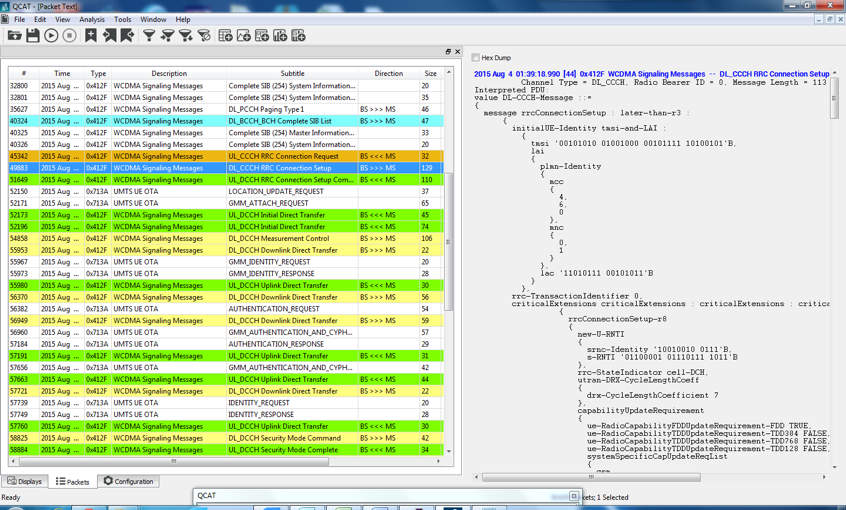
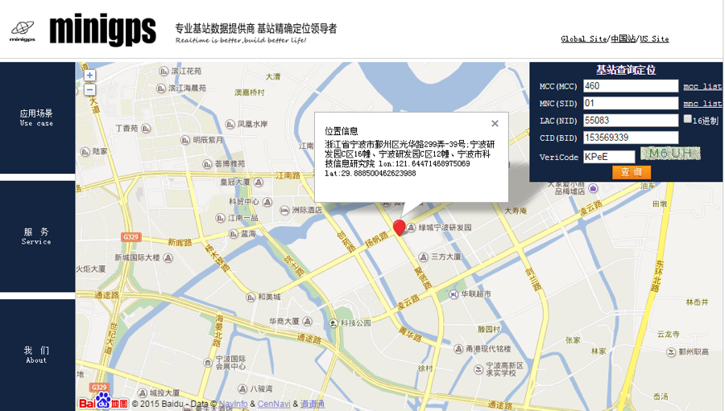

基于网络的`Cell-ID`定位技术是当移动用户处于一个全向天线覆盖Cell或是处于一个由定向天线覆盖的分扇区Cell时，可以根据一定的方式获取用户所在的蜂窝小区号，移动用户的位置就可以通过其当前所处在系统当中的位置小区`Cell-ID`转换成地理坐标或者服务区来识别。`Cell-ID`即`GCI`是全球小区识别码，每个蜂窝小区有一个唯一的小区识别码，`GCI`有位置区识别码`LAI`和小区识别码`CI`构成，即：`GCI = LAI + CI = MCC + MNC + LAC + CI`。

`Cell-ID`定位方法即使只有一个小区也能定位。`Cell-ID`技术不需要移动台提供任何定位测量信息，也无需对现网进行改动，只需要在网络侧增加简单的定位流程处理，很容易实现，并且空中接口的定位信令传输的很少，定位的时间非常短，因而`Cell-ID`定位技术在移动网络中被广泛使用。
<!-- more -->
**定位原理**：是网络根据MS当前的服务基站的位置和小区覆盖来定位移动台。若小区为全向小区，那么MS的位置就是以服务基站为中心，小区覆盖范围半径为半径的一个圆形区域内；若小区是分扇区，则MS位置范围为此扇形区域，相比全向小区，确定更小的范围。

优点：
1.	成本低
2. 系统和终端无需升级，现有的网络和终端都可以满足需求
3. 定位响应时间短
4. 定位覆盖无死角
缺点:
1. 定位精度低

使用联通卡在WCDMA 3G网络下进行验证：

小区号将在如下场景下获得： 
1、小区路由寻呼 2、定位区域更新 3、小区更新 4、URA更新 5、路由区更新 

操作：连接QXDM ，手机网络选择仅使用3G，打开QXDM抓取log，插拔SIM卡，保存log
log使用QCAT打开，过滤信令，点击RRC Connection Request信令，查看代码

记录：

```MCC 460 MNC 01（联通）```
```lac '11010111 00101011'B =  '55083'D```
```cell-id '10010010 01110100 10000011 1110'B = '153569342'D```

即:

```GCI = MCC + MNC + LAC + CI = 460 + 01 + 55083 + 153569342```



使用[minigps](http://www.minigps.net/cellsearch.html),输入MCC、MNC、LAC以及CI后即可装换成坐标位置在百度地图上显示



此时，模拟Cell-ID定位完成
