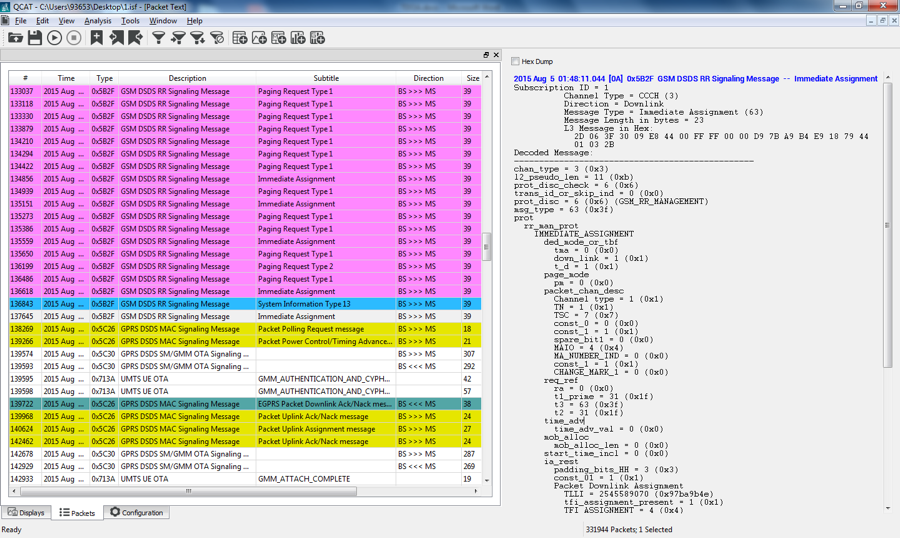
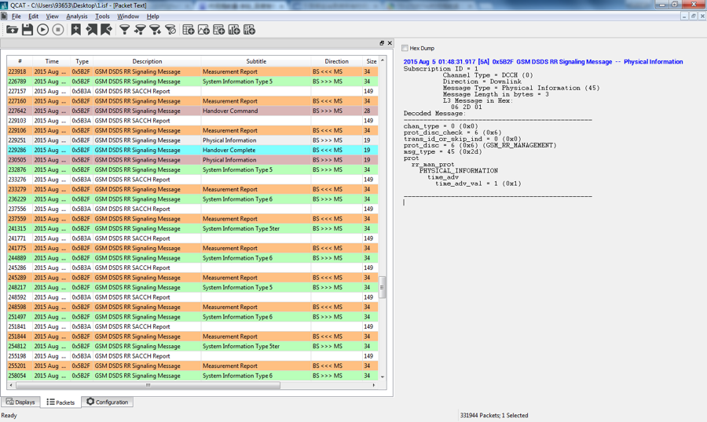
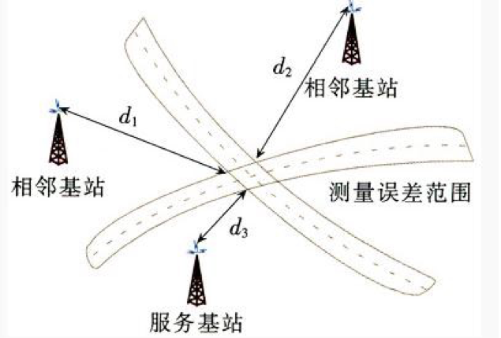
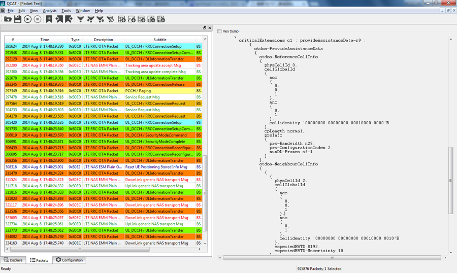
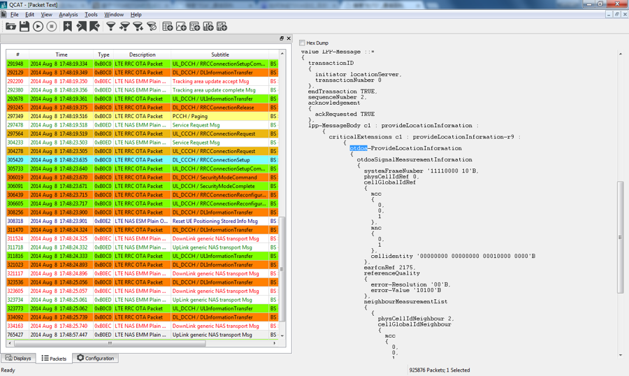

`TA`:时间提前量

在**GMS**系统中，在通信的工程中，如果移动台在呼叫期间远离基站的方向上移动，那么从基站发出的消息将越来越迟的到达移动台。与此同时，移动台的应答信息也会越来越迟的到达基站。而时延过长也会导致这样的一个情况：基站收到的移动台在本时隙上发送的消息与基站在其下一个时隙收到的另一个呼叫信息重叠起来，而引起码间干扰。因此在呼叫进行期间，移动台发给基站的测量报告头上携带有移动台测量的延值，基站必须监视呼叫到达的时间，并在下行信道上一480ms一次的频率向移动台发送指令，指示移动台提前发送的时间，这个时间就是**时间提前量**（*time advance，TA*）。移动台可以利用**TA**参数就可以调整信号码元的发送时刻，确保各移动台的信息到达基站时能避免时隙重叠。

<!-- more -->

**TA**的值域是0-63（0-233µs），它被**GSM**定时提前的编码0-63bit所限，所以GSM最大的覆盖距离是35km

计算如下：

$$1/2 * 3.7µs/bit * 63bit * C = 35km(1/2 * 3.7 * 10^{-6} * 63 * 3 * 10^8 ≈ 35000)$$

其中**3.7µs/bit**为每bit时长，63bit为时间调整最大比特数，**C**为光速，1/2是考虑信号往返。这样可以得出1bit对应的距离相当于554m。因为信号传播过程中会受到多径传播和ms同步精度的影响，TA的误差可能会达到3bit左右（1.6km），而理想情况下最高精度可以达到554m以内。所以**TA**定位测量的误差也较高。

**TA**定位也需要获取**Cell-ID**来获得大致的地理位置，然后用TA来确定移动台离基站的距离，得到比**Cell-ID**更加精确的位置。一个基站定位精度为基站覆盖范围；两个基站可以可到两个定位点，而三个基站即可确定并得到唯一一个点。为了得到高精度的点，需要对三个基站进行测量，这需要移动台进行小区呼叫切换。
**优点**：无须对移动台作任何改动，而对基站系统的改动也仅仅需要一个呼叫切换控制。
**缺点**：采取了强制小区切换，在TA定位过程中无法使用其他的业务通信，增加了信令负荷，需要进行TA测量，定位时间比**Cell-ID**长

示例：
使用QXDM抓取log并保存，之后log用QCAT打开，筛选过滤信令
在`Immediate Assignment`以及`Physical Information`字段中可以查看到可以看到**TA**，也可以直接搜索`time_adv`来查看**TA**值，按照文章上面的计算方法可以估算距离

`TOA`：到达时间
`TOA（Time of Arrival）`，`TOA`定位是需要测量移动台发射信号的到达时间，在发射的信号中添加包含发射时间标识，基站获得发射时间标识得到到达时间，根据到达时间计算移动台到基站的距离，在根据多个距离估计移动台的位置。
假设终端位置为（x,y），基站i的位置已知为（xi,yi），t为MS信号到BS的时间，C位光速，那距离$$Ct=\sqrt{((xi-x)^2+(y_i-y)^2)}$$ ，测量三个基站的到达时间既可获得移动台的位置。定位同`TA`定位法，但由于是测量传播时间，相比于TA有更高的精度。
**优点**：不用对现有的终端进行改造，定位精度较高，并可以提高时钟精度提高定位精度
**缺点**：基站需要改造增加测量单元，增加成本；移动终端和基站要做到时间同步，定位精度受时钟精度的影响，否则定位误差很大；同时向多个基站发射信号，增加功耗；信号传播过程受多径效应影响，造成误差。
`TDOA`：到达时间差
`TDOA（Time Difference of Arrival）`是`TOA`定位方法的改进。相比于`TOA`，`TDOA`不需要移动台和基站的时间精确同步，但基站的时间还是需要同步的。基站设置位置测量单元，之后测量移动台的发射信号的到达时间差。移动台与两个基站的距离的差是一个已知常数，那么根据到达时间快慢可以确定移动台为两基站双曲线的一条。三个基站双曲线焦点即为移动台。假设终端位置为（x,y），基站i的位置已知为（xi,yi）, 基站j的位置已知为（xj,yj）到达时间差为t，那么距离之差为Ct（C是光速），$$Ct=\sqrt{((xi-x)^2+(y_i-y)^2 )}-\sqrt{((xj-x)^2+(yj-y)^2 )}$$在列一个等式即可以确定位置。

相比于`TOA`，`TDOA`有如下优点：无需移动台和基站时间同步；计算误差对所有的基站是相同的且其和为零；移动台不需要发送发射时间标识。

提供TDOA定位辅助数据小区信息

提供定位信息以及测量信息。TDOA信令消息在LTE中是通过NAS层传输。
两种定位技术原理大致就是这样

