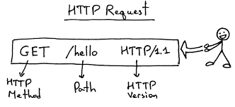
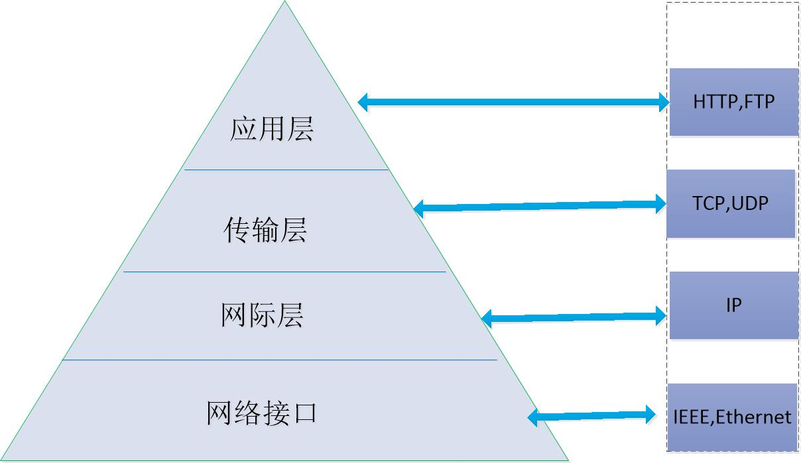
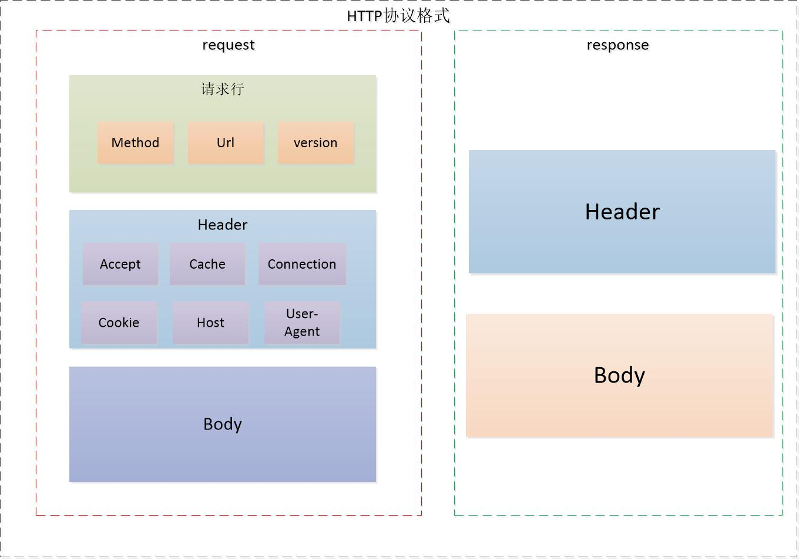

## 接口测试之http请求的理解

<!-- more -->
>原作者：刘文静  |  2017. 04. 14 

### 1. 从tcp到http

从TCP/IP四层网络模型讲起。一个典型的TCP/IP四层网络模型如下: 


对于我们要关注的是,http是建立在tcp的基础上的。

### 2 .一次典型的http连接过程

一次http请求，是由客户端发起，服务器响应，然后相互交换数据的过程。 


如上图所示，总结下。

第一步先建立连接通道
第二步发送消息，接受反馈
断开连接
我们通常称http为短连接，就是指这样一个过程。一个请求建立以后处理完消息以后就断开连接了。 当然如果我们http请求的时候每一次都需要一个连接建立和断开的过程的话， 对服务器性能和响应会有很大的压力。 所以在http协议中有加了keep_alive来 维持连接状态，第一次请求的时候不断开连接，而第二次请求的时候就不需要再次连接了。

当然在第二步的时候，客户端和服务器要进行信息的交互， 要一定要对消息的格式进行约定，这就是http协议结构了。

### 3. http协议结构详解

#### 3.1 http请求

http请求由三部分组成，分别是：请求行、消息报头(header)、请求正文（body）.



请求行由三部分组成：

消息类型(post、get、delete ...)
uri
版本号
消息报头(http header)：

`Accept`：指定客户端接受哪些类型的信息。eg：Accept:text/html,application/xhtml+xml,application/xml;q=0.9,image/webp,/;q=0.8

`Accept-Charset`： 客户端接受的字符集。 eg: Accept-Encoding:gzip, deflate, sdch

`Accept-Language`,类似于Accept，但是它是用于指定一种自然语言. eg: Accept-Language:zh-CN,zh;q=0.8,en;q=0.6
Cache-Control, 用于指定缓存指令 Cache-Control:no-cache

`Connection`, 是否长连接这。 为了下一次请求的性能。 eg: Connection:keep-alive

`Cookie`, http是无状态的，每次请求的时候服务器识别不了这个太电脑或者用户的请求是否已经请求过了。 
为了识别，第一次的请求的时候会在客户端存储一个cookie 在第二请求的时候带上以帮助识别。eg:Cookie:JSESSIONID=67EF1672E64799D80A696EBC0160E156

`Host`, eg:Host:localhost:8080

`User-Agent`,浏览器的版本信息。 我们普通的Http请求是不带的。很多爬虫程序就会在http header中加上User-Agent，以便欺骗我是一个浏览器。 User-Agent:Mozilla/5.0 (Windows NT 6.3; Win64; x64) AppleWebKit/537.36 (KHTML, like Gecko) Chrome/46.0.2467.2 Safari/537.36

`请求正文(http body)`： 请求的实际参数，通常用户做 post的时候的数据发送。

#### 3.2 get 和 post的区别

简单地来说，get是用来获取数据的，post是用来发送数据的。 当http get请求的时候通常不需要用到http body。 而在进行post的时候需要用到http body。

举个例子， 进行一次 http get ，其地址为 http://localhost:8080/increase ， 参数为id=1，那么

其url地址为：http://localhost:8080/increase?id=1
其http header为：

```
GET /increase?id=1 HTTP/1.1 
Host: localhost:8080 
Cache-Control: no-cache 
Postman-Token: 0aae2b06-2384-668e-eec9-ac94e149f2d8
http body为空
```
而当进行http post的时候, 如果其地址为 http://localhost:8080/postData， 参数为response:aaaa， 那么

其url为： http://localhost:8080/postData
其http header为：

```
POST /postData HTTP/1.1 
Host: localhost:8080 
Cache-Control: no-cache 
Postman-Token: 20f272d2-cb4c-423e-a292-d8f563ffed42 
Content-Type: multipart/form-data; 
boundary=----WebKitFormBoundary7MA4YWxkTrZu0gW
```
其 http body为：

`response:aaaa`

### 4. http返回

如上我们要对http的请求做格式约定，那必定也必须对http的返回也做格式的约定。这里就引出了： Respose Header和Response body的概念。

客户端进行一个http请求，服务器端必定要返回这个请求对应的数据。这些数据就放在 Respose body中，但是这些数据是有格式的，客户端要对这些格式做解析那必定要按照一定的格式。这些格式就定义在 Respose Header中，典型的如：

```
Content-Length:1
Content-Type:text/html;charset=UTF-8
```
又如一个js文件：

```javascript
Accept-Ranges:bytes
Age:9472819
Cache-Control:max-age=31536000
Connection:keep-alive
Content-Encoding:gzip
Content-Length:580
Content-Type:text/javascript
Date:Thu, 13 Apr 2017 07:37:40 GMT
ETag:"3616102196"
Expires:Sun, 24 Dec 2017 16:17:21 GMT
Last-Modified:Mon, 28 Sep 2015 08:00:43 GMT
Ohc-Response-Time:1 0 0 0 0 0
Server:JSP3/2.0.14
Vary:Accept-Encoding    
Date:Thu, 13 Apr 2017 07:18:58 GMT
```